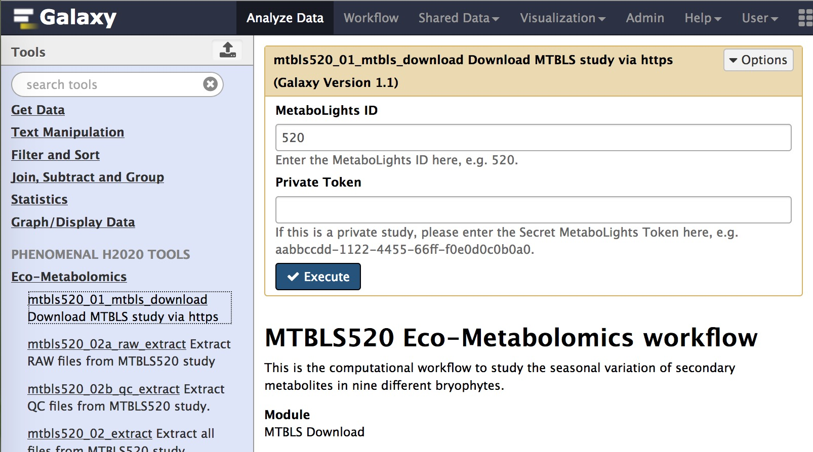
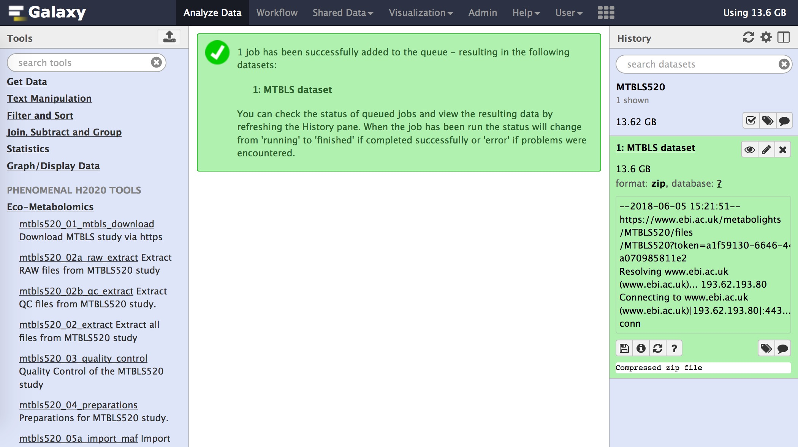
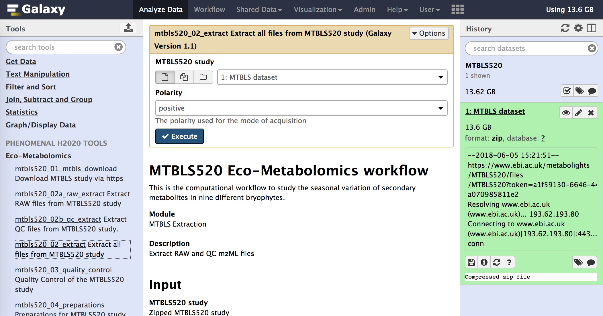
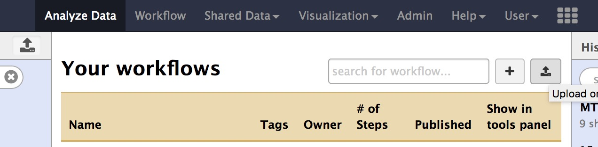
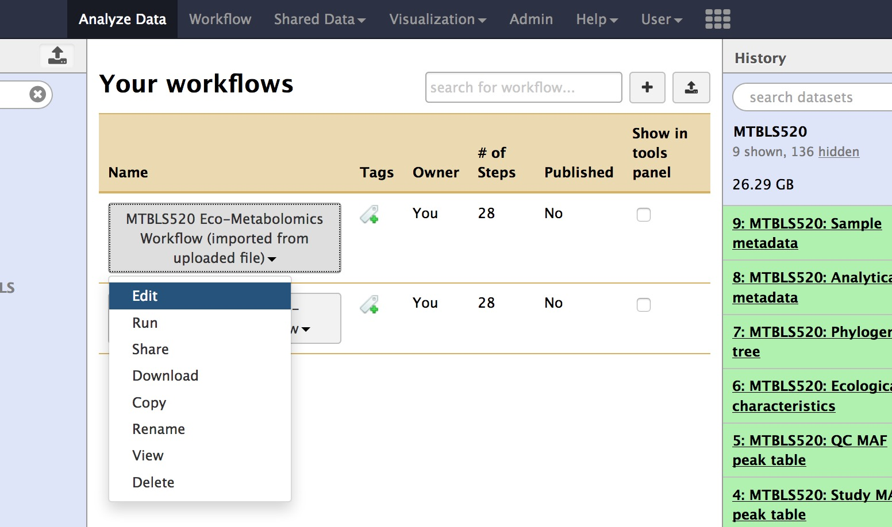
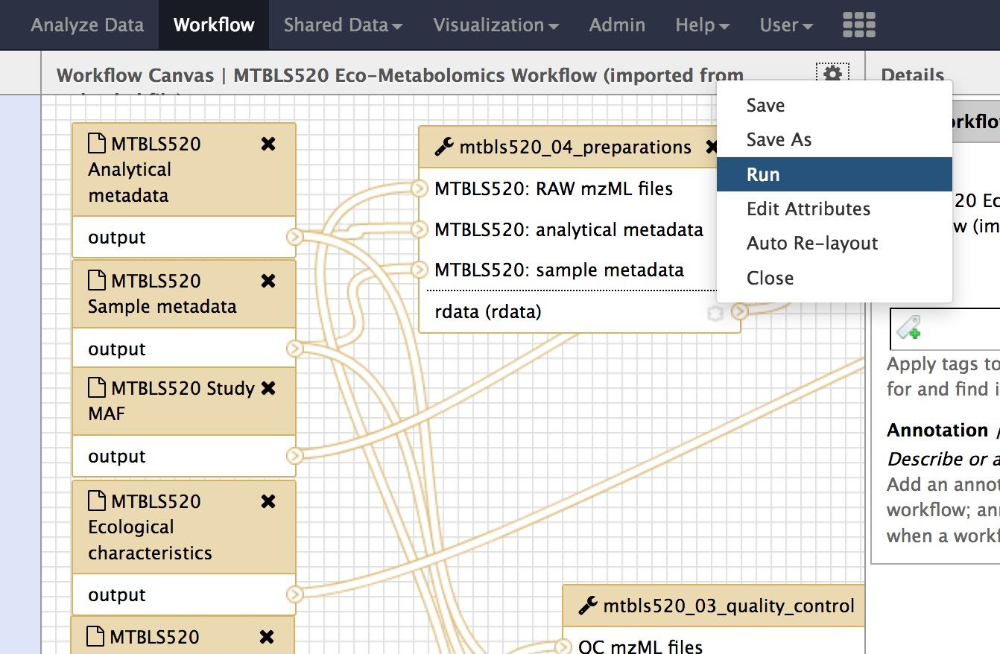
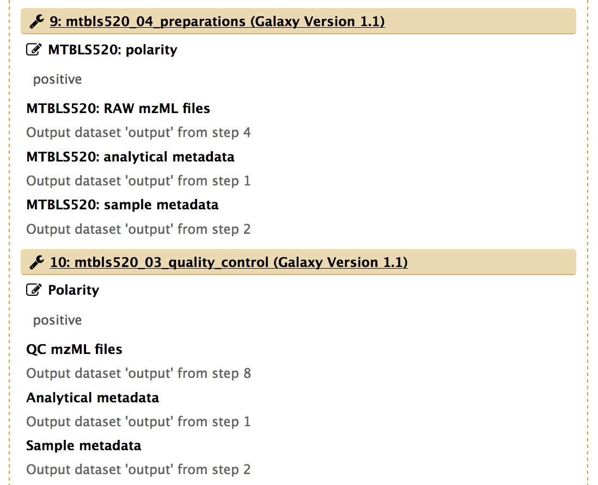
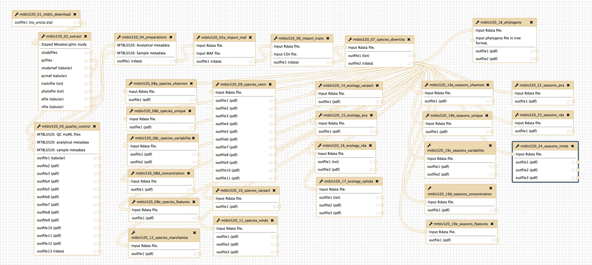
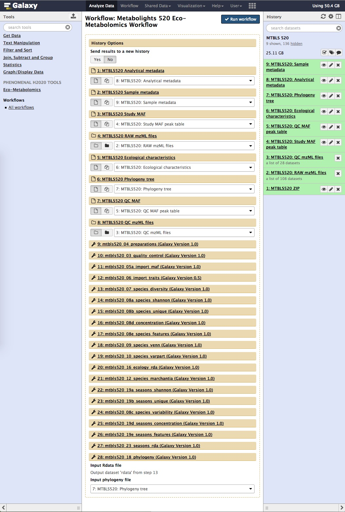

# Instructions to run the computational workflow to study the seasonal variation of secondary metabolites in nine different bryophytes using the MTBLS520 dataset
This document includes instructions on how to run the Galaxy workflow, which processes the MTBLS520 dataset as described in the publication in Nature Scientific Data [1].

## Prerequisites
First, please ask your local Galaxy administrator to install the modules as listed in [the galaxy directory](../galaxy/), or put the modules yourself in the `ecomet` directory in the tools directory of Galaxy. Please make sure that you have installed and enabled docker on your system and in the `galaxy.ini`. 

Now, edit your `tool_conf.xml` and add the following entries:

```  <section name="Eco-Metabolomics" id="ecomet">
    <tool file="ecomet/mtbls520_01_mtbls_download.xml"/>
    <tool file="ecomet/mtbls520_02a_raw_extract.xml"/>
    <tool file="ecomet/mtbls520_02b_qc_extract.xml"/>
    <tool file="ecomet/mtbls520_02_extract.xml"/>
    <tool file="ecomet/mtbls520_03_quality_control.xml"/>
    <tool file="ecomet/mtbls520_04_preparations.xml"/>
    <tool file="ecomet/mtbls520_05a_import_maf.xml"/>
    <tool file="ecomet/mtbls520_05b_peak_picking.xml"/>
    <tool file="ecomet/mtbls520_06_import_traits.xml"/>
    <tool file="ecomet/mtbls520_07_species_diversity.xml"/>
    <tool file="ecomet/mtbls520_08a_species_shannon.xml"/>
    <tool file="ecomet/mtbls520_08b_species_unique.xml"/>
    <tool file="ecomet/mtbls520_08c_species_variability.xml"/>
    <tool file="ecomet/mtbls520_08d_concentration.xml"/>
    <tool file="ecomet/mtbls520_08e_species_features.xml"/>
    <tool file="ecomet/mtbls520_09_species_venn.xml"/>
    <tool file="ecomet/mtbls520_10_species_varpart.xml"/>
    <tool file="ecomet/mtbls520_11_species_nmds.xml"/>
    <tool file="ecomet/mtbls520_12_species_marchantia.xml"/>
    <tool file="ecomet/mtbls520_14_ecology_varpart.xml"/>
    <tool file="ecomet/mtbls520_15_ecology_pca.xml"/>
    <tool file="ecomet/mtbls520_16_ecology_rda.xml"/>
    <tool file="ecomet/mtbls520_17_ecology_splsda.xml"/>
    <tool file="ecomet/mtbls520_18_phylogeny.xml"/>
    <tool file="ecomet/mtbls520_19a_seasons_shannon.xml"/>
    <tool file="ecomet/mtbls520_19b_seasons_unique.xml"/>
    <tool file="ecomet/mtbls520_19c_seasons_variability.xml"/>
    <tool file="ecomet/mtbls520_19d_seasons_concentration.xml"/>
    <tool file="ecomet/mtbls520_19e_seasons_features.xml"/>
    <tool file="ecomet/mtbls520_22_seasons_pca.xml"/>
    <tool file="ecomet/mtbls520_23_seasons_rda.xml"/>
    <tool file="ecomet/mtbls520_24_seasons_nmds.xml"/>
  </section>
```

After a restart of Galaxy, the modules should appear in the left tool pane of Galaxy.

## Tutorial








Following is an overview of the Galaxy workflow for the MTBLS520 dataset.



The workflow should be started with the following parameter settings:



## Publications
[1] Peters, K., Gorzolka, K., Bruelheide, H. & Neumann, S. (2018): Computational workflow to study the seasonal variation of secondary metabolites in nine different bryophytes. Nature Scientific Data. In Review.

[2] Peters, K., Gorzolka, K., Bruelheide, H. & Neumann, S. (2018): Seasonal variation of secondary metabolites in nine different bryophytes. Ecology and Evolution. In Review.

[3] Peters, K., Gorzolka, K., Bruelheide, H. & Neumann, S. (2018): Seasonal variation of secondary metabolites in 9 different moss and liverwort species. MetaboLights 520. https://www.ebi.ac.uk/metabolights/MTBLS520

[4] Peters, K., Gorzolka, K., Bruelheide, H. & Neumann, S. (2018): Container for the Galaxy workflow to process the MTBLS520 dataset. DockerHub. https://hub.docker.com/r/korseby/mtbls520/

[5] Peters, K., Gorzolka, K., Bruelheide, H., & Neumann, S. (2018). Code for the computational workflow to study the seasonal variation of secondary metabolites in nine different bryophytes using the MTBLS520 dataset (Version v1.0). Zenodo. http://doi.org/10.5281/zenodo.1248510

